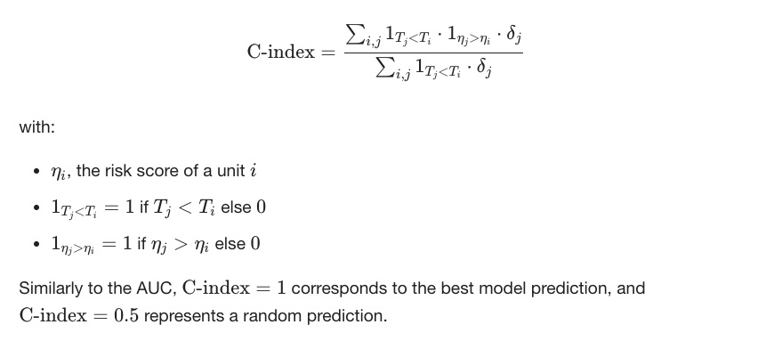

# Kaggle-HCT-Survival-Predictions
[CIBMTR - Equity in post-HCT Survival Predictions](https://www.kaggle.com/competitions/equity-post-HCT-survival-predictions/)


## Survival Prediction for HCT Patients

This project aims to improve survival predictions for patients undergoing allogeneic Hematopoietic Cell Transplantation (HCT). Many existing models fail to consider disparities based on socioeconomic status, race, and geography. Our goal is to develop accurate and fair predictive models that work well for all patient groups.

Using synthetic data, we will build machine learning models that enhance both precision and fairness in survival predictions. This will help ensure equitable healthcare outcomes for diverse patients and improve trust in medical predictions.

### 🚀 Key Focus:

Improve accuracy of survival predictions.
Reduce biases related to race, location, and socioeconomic factors.
Use synthetic data to protect patient privacy.
Ensure fair and ethical AI in healthcare.
This project contributes to a more just and effective healthcare system, ensuring every patient gets the best possible care. 💙


## Evaluation
#### Evaluation Criteria
The evaluation of prediction accuracy in the competition will involve a specialized metric known as the Stratified Concordance Index (C-index), adapted to consider different racial groups independently. This method allows us to gauge the predictive performance of models in a way that emphasizes equitability across diverse patient populations, particularly focusing on racial disparities in transplant outcomes.

#### Concordance index
It represents the global assessment of the model discrimination power: this is the model’s ability to correctly provide a reliable ranking of the survival times based on the individual risk scores. It can be computed with the following formula:



## Steps:
0. Download [Anaconda](https://www.anaconda.com/download)
1. Download [VsCode](https://code.visualstudio.com/download)
2. Download [GitHub cmd interfece (git)](https://git-scm.com/downloads)
3. Open [Github website](https://github.com/)
4. Create Repository [Kaggle-HCT-Survival-Predictions](https://github.com/sourabhprajapati22/Kaggle-HCT-Survival-Predictions)
5. Clone Repository
    ```
    git clone https://github.com/sourabhprajapati22/Kaggle-HCT-Survival-Predictions.git
    ```
6. Change directory
    ```
    cd Kaggle-HCT-Survival-Predictions
    ```
7. Create virtual environment (Differences Between --name and --prefix)
    **Method** | **Stores Env In** | **Activation Command** | **Use Case**  
    --- | --- | --- | ---  
    `--name` | `~/anaconda3/envs/env_name` | `conda activate env_name` | Shared environments  
    `--prefix` | `./env` (or any specified path) | `conda activate ./env` | Project-specific environments  

    ```
    conda create --prefix ./venv python==3.8 -y
    conda activate ./venv
    
    ```

8. Create template.py
    ```
        📂 Kaggle-HCT-Survival-Predictions/
    │── 📂 data/                  # Store dataset (if allowed)
    │   ├── 📂 raw/               # Unprocessed original data
    │   ├── 📂 processed/         # Cleaned/engineered data
    │── 📂 notebooks/             # Jupyter notebooks for EDA & modeling
    │   ├── 01_eda.ipynb          # Exploratory Data Analysis
    │   ├── 02_feature_engineering.ipynb
    │   ├── 03_model_training.ipynb
    │   ├── 04_evaluation.ipynb
    │── 📂 src/                   # Source code for ML pipeline
    │   ├── data_preprocessing.py # Data cleaning & feature engineering
    │   ├── train.py              # Training script
    │   ├── inference.py          # Inference script
    │── 📂 models/                # Saved models
    │   ├── best_model.pth        # Best trained model
    │   ├── experiment_1.pkl
    │── 📂 scripts/               # Bash scripts for automation
    │   ├── run_train.sh
    │── 📂 logs/                  # Training logs & experiment tracking
    │── 📂 reports/               # Results & analysis
    │── 📂 configs/               # Config files (YAML/JSON)
    │── 📂 submission/            # Kaggle submission files
    │   ├── submission.csv
    │── .gitignore                # Ignore unnecessary files
    │── README.md                 # Project documentation
    │── requirements.txt          # Python dependencies
    │── LICENSE                   # Open-source license (e.g., MIT)
    ```

9. git actions taken
    ```
    git remote -v
    git remote add origin https://github.com/sourabhprajapati22/Kaggle-HCT-Survival-Predictions.git
    git add .
    git commit -m "Complete the template.py file"
    git push origin main
    ```
11. download required packages
    ```
    create file requirements.txt
    -numpy
    -pandas
    -matplotlib
    -seaborn
    -scikit-learn
    -catboost
    -lightgbm
    -xgboost
    -ipykernel
    -lifelines
    -umap-learn
    -pyFFM
    pip install -r requirements.txt
    ```
10. Data handling
    ```
    Download Data manually.
    You cans also download using kaggle API key.
    Download and upload in data/raw folder.
    ```
12. Exploratry Data Analysis
    ```
    numerical_col=['donor_age','age_at_hct','year_hct','efs_time']
    target_col='efs'
    categorical_col=others

    I observed that all categorical columns are imbalanced. If I apply any fold or data-splitting technique, the model will be trained on imbalanced categorical features. To address this, I use One-Hot Encoding for categorical columns to ensure a balanced representation of all categories.

    ```
13. Feature Engineering
    ```
    1. Feature encoding (One-Hot encoder)
    2. Feature scaling (Standard Scaler)
    3. Dimensionality reduction (PCA, TSNE, UMAP)
    4. Feature Selection (explore in model training directly)
    ```
14. Model Training
    ```
    conda install -c conda-forge ipywidgets //for jupyter notebook run properly
    OneHotEncoder, StandardScaler, PCA
    drop imbalanced columns
    use StratifiedGroupKFold

    ```
15. Final Evaluation and Result (Kaggle Score)
    **Tag**         | **Models** | **Public_Score** | **Private_score**  
    ---             | --- | ---     | ---
    voting_2        | cat+xgb+rf+lgbm    | 0.670 | 0.674 
    voting_3        | cat+xgb+lgbm       | 0.672 | 0.676
    voting_4        | cat+lgbm           | 0.671 | 0.673 
    voting_2+3+4    |       -            | 0.672 | 0.675
    
## Citation  
If you use this work, please cite it as shown in [`CITATION.bib`](CITATION.bib).
